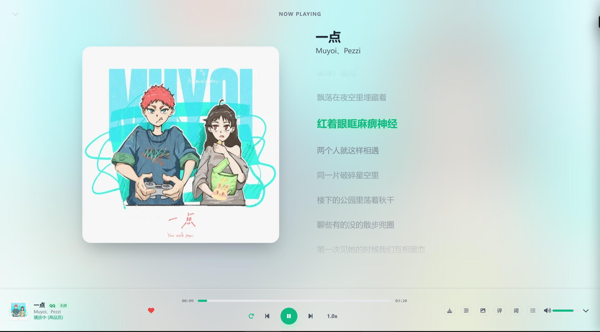
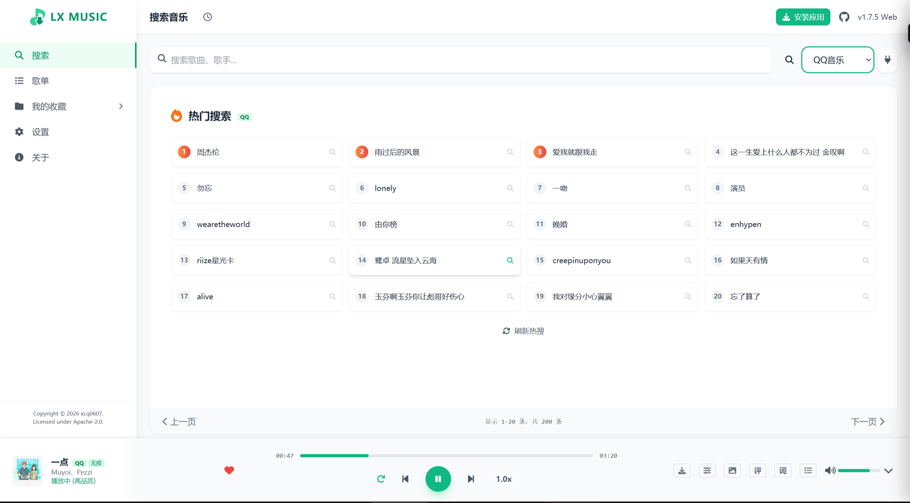
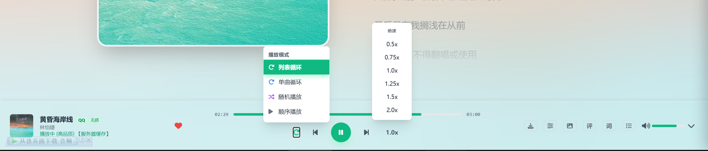

# LX Music Player

聚合多平台音乐搜索与在线播放的 Web 播放器。

- **源码仓库**: https://github.com/harbiu317/lxserver
- **上游项目**: https://github.com/XCQ0607/lxserver
- **端口**: 17000
- **许可证**: Apache-2.0

## 功能

- 多平台聚合搜索（网易云、QQ、酷狗、酷我、咪咕）
- 多音质选择（128k/320k/FLAC/Hi-Res）
- 自定义音源管理
- 歌词显示、音频可视化
- 缓存管理、歌词卡片分享
- LX Music 客户端数据同步
- PWA 支持

## 预览

  

  

  

