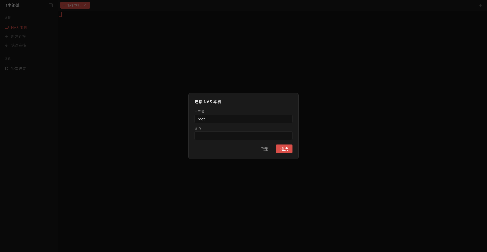

# 飞牛终端

> 飞牛 NAS（fnOS）的 Web SSH 终端应用。

## 功能特性

### 终端模拟器
- 基于 xterm.js 的全功能终端，支持 256 色、Unicode、中文输入
- 多标签页管理，同时打开多个终端会话
- 终端内容复制粘贴、可点击链接

### SSH 连接管理
- **NAS 本机连接** — 一键 SSH 连接到本地 NAS
- **远程服务器** — 保存常用服务器配置（主机、端口、用户名）
- **快速连接** — 输入地址直接连接，无需保存
- 支持密码 / 私钥认证
- 密码采用 AES-256-GCM 加密存储

### 主题
- 7 套终端配色方案，UI 跟随系统深浅色自动切换

## 系统要求

- fnOS ≥ 1.1.8
- 架构：x86_64

## 截图

| 终端界面 | 连接选择器 |
|---|---|
|  |  |

## 链接

- 项目主页：https://github.com/harbiu317/feiniu-terminal
- 发布版本：https://github.com/harbiu317/feiniu-terminal/releases
- 问题反馈：https://github.com/harbiu317/feiniu-terminal/issues
